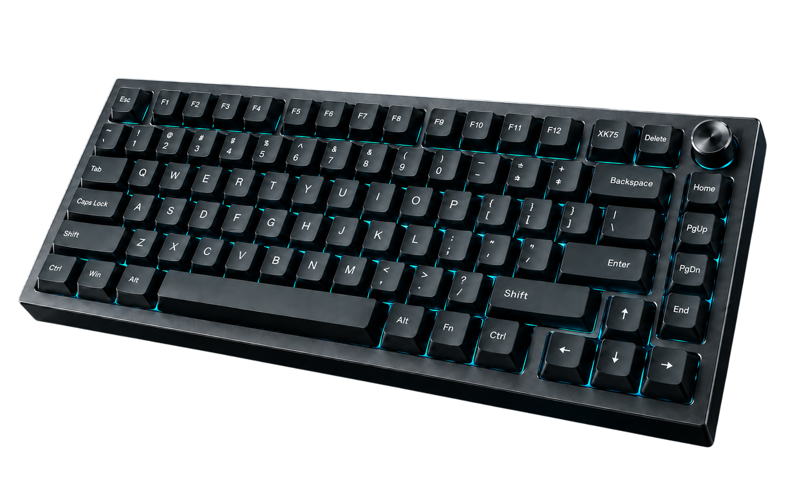
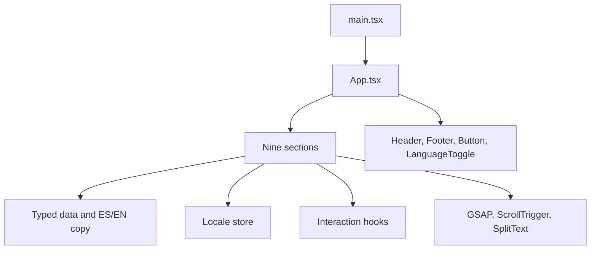
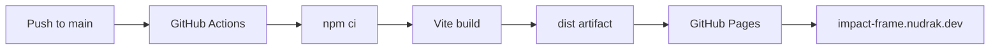

# IMPACT-FRAME XK75

Interactive launch page for a fictional mechanical keyboard. The project demonstrates visual direction, frontend structure, animation, and interaction in a single static page.

**Engineering for Minds That Build.**

Live site: [impact-frame.nudrak.dev](https://impact-frame.nudrak.dev) · Repository: [Donovan-Nudrak/impact-frame-xk75](https://github.com/Donovan-Nudrak/impact-frame-xk75)

[](https://github.com/Donovan-Nudrak/impact-frame-xk75/actions/workflows/deploy.yml)
[](https://react.dev/)
[](https://www.typescriptlang.org/)
[](https://vite.dev/)
[](https://gsap.com/)
[](https://impact-frame.nudrak.dev)

<p align="center">
  
</p>

## Project overview

IMPACT-FRAME XK75 presents a compact 75% keyboard as a conceptual hardware launch. The page walks through identity, construction, mechanism, materials, connectivity, and a specification sheet.

The scope is a static, responsive, interactive frontend. Content lives in the repository. The page is not a store and does not represent a commercial product. The published build is served from [https://impact-frame.nudrak.dev](https://impact-frame.nudrak.dev).

## Experience

| Section | Role |
| --- | --- |
| Hero | Product identity, tagline, and reserve call to action |
| Manifesto | Editorial statement with a line-by-line text reveal |
| Architecture | Eight-layer stack; the selected layer stays fully visible |
| Switch System | Click to compress the switch cross-section, then release it |
| Materials | Six photographic studies of chassis, keycaps, knob, finish, plate, and foam |
| Performance | Schematic paths for USB-C, 2.4 GHz, and Bluetooth |
| Specifications | Conceptual sheet for product, construction, connectivity, and controls |
| Reserve | Local name and email form; submission is not stored |
| Final Statement | Closing product view and return to the top |

## Key features

- In-page navigation through anchor links in the header and footer. On narrow viewports the header links move into a menu.
- Spanish and English copy, switched in the header without a reload.
- Locale persisted in `localStorage` under `if-xk75-locale`.
- GSAP entrance sequences coordinated with ScrollTrigger.
- Limited pointer parallax on the Hero keyboard, active only for a fine pointer with hover.
- Eight-layer construction stack. The active layer changes when its row is selected.
- Switch cross-section that compresses and returns on click.
- Connectivity diagram for USB-C, 2.4 GHz, and Bluetooth. The drawing is a schematic, not a measurement.
- Conceptual specification sheet. Lighting and the machined knob appear as copy only.
- Reserve form with local validation. Submitting it replaces the form with a notice that the product is fictional. Nothing is sent or stored.
- `prefers-reduced-motion` support across the implemented sections.
- Footer links to LinkedIn, GitHub, and [nudrak.dev](https://nudrak.dev).

## Technology stack

Versions below are the ones installed from `package-lock.json`. CSS Modules are provided by Vite; they are not a separate package. The badges above follow the ranges declared in `package.json`.

| Package | Version | Role |
| --- | --- | --- |
| React / React DOM | 19.3.0 | UI |
| TypeScript | 6.0.3 | Types |
| Vite | 8.3.0 | Dev server and static build |
| `@vitejs/plugin-react` | 6.1.1 | React transform |
| GSAP | 3.15.0 | Animation |
| `@gsap/react` | 2.1.2 | `useGSAP` lifecycle |
| Lucide React | 1.47.0 | Icons |
| Fontsource | 5.3.0 | Local WOFF2 faces |
| Oxlint | 1.83.0 | Lint |
| Vitest | 5.0.1 | Tests |
| jsdom | 30.1.0 | Test DOM |

Node.js `>=22.12.0` (`engines` in `package.json`). The deploy workflow installs Node 22.

Fontsource supplies Barlow Condensed, Inter, IBM Plex Mono, and Orbitron (latin subsets). Orbitron is used for the Hero product title.

## Technical architecture

`index.html` loads `src/main.tsx`, which mounts `src/App.tsx`. The app composes the header, the nine sections, and the footer. Each section owns its CSS Module.



Typed data in `src/data/` describes layers, switch parts, materials, connection modes, specification groups, and navigation. Interface copy lives in `src/data/copy/` as paired English and Spanish dictionaries. `src/i18n/localeStore.ts` holds the active locale in module state. `useLocale` reads it with `useSyncExternalStore`.

Interaction state stays local to the component that needs it: the open menu, the selected layer, the selected switch part, the connection mode, and the reserve form. There is no global client store and no server.

Depth is built from PNG cutouts, CSS transforms, and GSAP. The connectivity diagram is SVG. The page does not use WebGL or a 3D model.

```text
src/
  main.tsx
  App.tsx
  sections/          Hero, Manifesto, Architecture, SwitchSystem,
                     Materials, Performance, Specifications, Reserve,
                     FinalStatement
  components/        Header, Footer, Button, LanguageToggle
  hooks/             locale, reduced motion, pointer parallax, pointer sheen
  i18n/              locale store
  data/              typed content and ES/EN dictionaries
  lib/               GSAP registration and reveal helpers
  styles/            tokens, fonts, reset, global CSS
  assets/            mounted PNG images
public/              favicon
```

## Animation and interaction

`src/lib/gsap.ts` registers `ScrollTrigger`, `SplitText`, and `useGSAP`. Section entrances use `useGSAP`, so tweens are killed when a section unmounts.

ScrollTrigger runs those entrances once, when a section reaches its start position (`toggleActions: "play none none none"`). It does not pin a section or scrub a timeline. Manifesto reveals headline and body line by line with SplitText. Final Statement runs a short timeline as the section enters. If a reveal leaves an element at opacity 0 while it is already on screen, `releaseStuckReveals` completes it and clears inline opacity, visibility, and transform. A hash change does the same for the targeted section, so anchor navigation does not depend on the animation finishing.

Other motion is independent of scroll progress:

- Hero parallax maps pointer position to `rotationX` and `rotationY` through `gsap.quickTo`. Cleanup removes only those two properties.
- Architecture changes the highlighted layer from the selector. Opacity and vertical offset are CSS.
- Switch System plays a click timeline: parts move down onto the lower housing, the spring compresses, then the stack opens again. A new click kills the previous timeline.
- Materials applies a pointer sheen on fine pointers and fades blocks in on entrance.
- Performance draws the active signal once on entrance and again when the mode changes. The previous tween is killed first. USB-C is a continuous line, 2.4 GHz a dashed line with pulses, and Bluetooth five arcs. The traveling mark fades out at the end of the USB-C and 2.4 GHz paths.

## Internationalization and accessibility

The header toggle calls `setLocale`. That updates module state, sets `document.documentElement.lang`, writes `localStorage`, and notifies subscribers. The page does not reload.

Initial locale order:

1. `if-xk75-locale`, when the stored value is `es` or `en`.
2. `navigator.language`, when it starts with `es`.
3. `en`.

If `localStorage` throws, the selected locale stays in memory.

The page uses `header`, `nav`, `main`, `section`, and `footer`. Sections expose accessible names. Header and footer links are ordinary anchors. External profile links open in a new tab. The narrow menu exposes `aria-expanded` and `aria-controls`; Escape closes it and returns focus to the menu button. The reserve form uses associated labels, `aria-invalid`, and error text. Focus moves to the first invalid field. The confirmation is a `role="status"` region inside the section.

`useReducedMotion` reads `prefers-reduced-motion: reduce`. When it matches, entrance tweens are skipped and the switch press uses a short state change instead of the timeline. CSS in the sections also reduces motion.

## Getting started

Requirements: Node.js 22.12 or newer, and npm.

```bash
npm install
npm run dev
```

Vite serves the app locally. Further checks:

```bash
npm run typecheck
npm run lint
npm test
npm run build
npm run preview
```

`npm run build` typechecks the project and writes a static site to `dist/`. `npm run preview` serves that output locally. Vite `base` is `"/"`, so asset URLs are root-relative.

## Available scripts

| Script | Command | Purpose |
| --- | --- | --- |
| `dev` | `vite` | Development server |
| `build` | `tsc -b && vite build` | Typecheck and production build |
| `preview` | `vite preview` | Serve the production build |
| `typecheck` | `tsc -b --pretty` | Project references typecheck |
| `lint` | `oxlint .` | Static analysis |
| `lint:fix` | `oxlint . --fix` | Apply Oxlint fixes |
| `test` | `vitest run --passWithNoTests` | Run unit tests once |
| `test:watch` | `vitest` | Vitest in watch mode |

Vitest is configured in `vite.config.ts` with the `jsdom` environment and includes `src/**/*.{test,spec}.{ts,tsx}`.

## Project limitations

XK75 is a fictional product. The footer and the reserve section state that the page is a frontend demonstration.

There is no backend, authentication, payment flow, or real reservation. The reserve form validates name and email in the browser and then discards the values.

There is no WebGL, no 360° viewer, and no connection to hardware or firmware.

The specification sheet omits values that the concept does not define. It does not state dimensions, weight, battery capacity, battery life, polling rate, latency, or operating-system compatibility. Connectivity graphics do not report measured performance. Lighting and the machined knob appear as specification copy only; the page has no controls for color, intensity, lighting mode, or finish.

## Deployment

A push to `main` runs [`.github/workflows/deploy.yml`](.github/workflows/deploy.yml). The workflow checks out the repository, installs dependencies with `npm ci` on Node 22, runs `npm run build`, uploads `dist` with `actions/upload-pages-artifact`, and publishes it with `actions/deploy-pages`. `actions/configure-pages` prepares the Pages environment. The job needs `contents: read`, `pages: write`, and `id-token: write`.



The site is published at [https://impact-frame.nudrak.dev](https://impact-frame.nudrak.dev). `base` in `vite.config.ts` is `"/"`, so the custom domain loads scripts, styles, and images from the site root.

## Credits

The page footer attributes the work to Donovan, © 2026, and links to [LinkedIn](https://www.linkedin.com/in/donovan-a-83b7ba3a2), [GitHub](https://github.com/Donovan-Nudrak), and [nudrak.dev](https://nudrak.dev).
